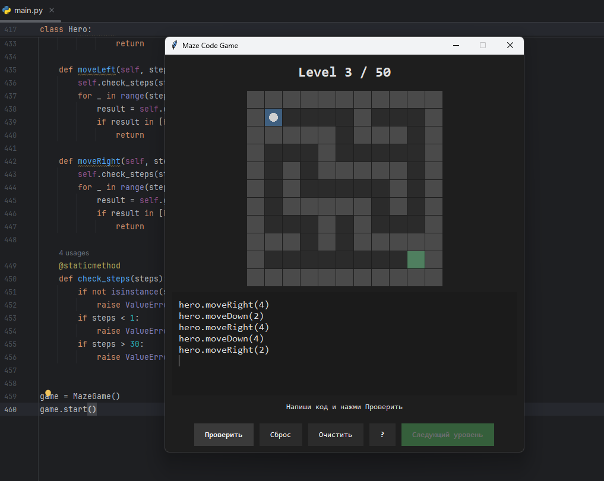

# 🧠 Maze Code Game

> You don’t play the game…  
> **you program it.**

---

## 🎮 Preview



---

## 🎥 Gameplay

<video src="gameplay.mp4" controls width="700"></video>

---

## 🚀 The Idea

I wanted to understand programming not by reading theory,  
but by **seeing code come to life**.

So I built a small game where:

- you don’t press buttons  
- you don’t use arrows  
- you **write code**  

And the character follows it.

---

## 💡 How it works

You control the character like this:

```python
hero.moveRight(3)
hero.moveDown(2)
hero.moveLeft(2)
hero.moveUp(5)
